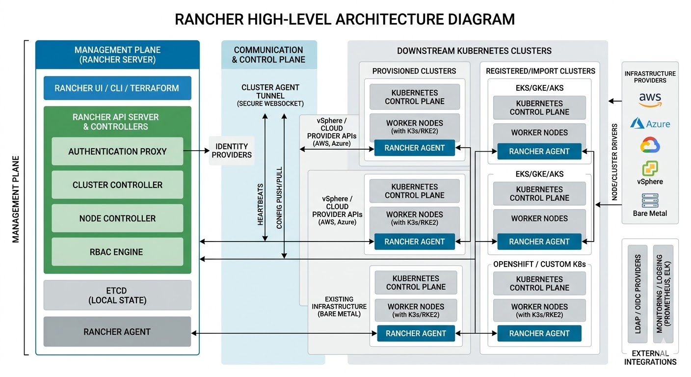

# Day 3

## Info - Rancher High-Level Architecture

<pre>
- Rancher is an enterprise-grade Kubernetes management platform that allows you to manage multiple clusters 
  across various cloud providers, on-premises data centers, and edge locations from rancher webconsole
- 1. Rancher Manager (Control Plane)
     - is the core of the system. 
     - runs on its own dedicated Kubernetes cluster (often a small RKE2 or K3s cluster) 
     - has several components
       - API Server
         - acts as the entry point for all requests
         - handles authentication, authorization, and proxies requests to managed clusters
       - Authentication Proxy
         - integrates with external identity providers (like LDAP, AD, or SAML) to manage user access
       - Cluster Controllers
         - watches for changes in the managed clusters and ensure the desired state 
           - For example 
             - node count is maintained
       - etcd 
         - stores the configuration and state of the Rancher Manager itself 
           and the metadata of all managed clusters
  
- 2. Managed Downstream Clusters
     - these are the Kubernetes clusters where your actual workloads (applications) live. 
       Rancher can manage:
       - Registered Clusters
         - Existing clusters (like GKE, EKS, or AKS) imported into Rancher.

       - Provisioned Clusters
         - Clusters created by Rancher on infrastructure providers (like KVM, vSphere, AWS, or Azure)
       - Custom Clusters
         - Clusters where you provide the nodes, and Rancher installs the Kubernetes distribution (RKE2 or K3s)
</pre>

## Info - Rancher Agent
<pre>
- Rancher agent runs in every managed cluster
- it establishes a secure tunnel back to the Rancher Manager
- allows the Rancher Manager to communicate with clusters even if they are behind a firewall or in a private network
- agent handles the deployment of workloads and monitoring data collection.  
</pre>

## Info - Communication Flow
<pre>
- Rancher uses a "push/pull" hybrid model
- The Rancher Manager pushes configuration changes and commands, 
  while the Rancher Agent pulls instructions and reports the health status of the downstream cluster
- Key Benefits of this Architecture
  - Centralized RBAC
    - Define a user once in Rancher and give them specific permissions across 50 different clusters
  - Multi-Cluster Consistency
    - Deploy the same security policies or "Apps" (via Helm charts) to multiple clusters simultaneously
  - Unified Visibility
    - View logs, metrics, and events from all clusters in one dashboard
</pre>

## Info - The Authentication Flow
<pre>
- is a critical subset of the Rancher API server
- instead of each downstream cluster needing its own connection to your identity provider, 
  Rancher centralizes the handshake
- Request
  - an user attempts to log in via the Rancher UI or CLI
  - Identity Provider (IdP) 
    - Rancher routes the credentials to your configured service (e.g., 389 Directory Server/LDAP, Keycloak, or Active Directory)
  - Token Generation: Once authenticated, Rancher issues a Local Token
- Downstream Mapping
  - When the user accesses a specific managed cluster, the Authentication Proxy validates 
    their local token and maps their identity to the correct Kubernetes RBAC permissions 
   on that specific cluster
</pre>

## Info - Node and Cluster Management
<pre>
- Rancher interacts with the infrastructure layer using Node Drivers or Cluster Drivers
- this allows the manager to handle the lifecycle of the nodes themselves (provisioning, scaling, and repairing)
- Node Drivers Talk to APIs (like vSphere, AWS, or OpenStack) to create the raw virtual machines
- Cluster Drivers handle the installation of the Kubernetes engine (RKE2 or K3s) 
  and the necessary certificates
</pre>

## Info - Centralized Management Components
<pre>
Fleet Controller - Manages GitOps-style deployments across thousands of clusters
Catalog Controller - Manages Helm chart repositories and application
Auth Controller - Synchronizes user groups and permissions from the IdP to the clusters
</pre>

## Info - Networking: The Cluster Agent Tunnel
<pre>
- One of the most robust parts of the architecture is how Rancher communicates with clusters in private networks
- The Rancher Agent initiates an outbound WebSocket tunnel to the Rancher Manager
- This means you don't have to open inbound firewall ports on your remote resource-constrained or 
  edge locations to manage them
</pre>

## Info - Helm Overview
<pre>
- Helm is a Package Manager to install/uninstall/upgrade/downgrade applications in RKE2/K3S Clusters
- Helm also depends on the kubeconfig file or the KUBE_CONFIG environment to understand how to connect rancher cluster
- Instead of deploying application with plain manifest(yaml) files, one by one following a particular sequence, we could
  create Helm Charts ( your declaratives scripts packaged following certain directory structure )
- it is compressed zip file, internally it maintains the directory structure
- that way it is easy share the application package(chart) between teams within/outside your organization
- one can use JFrog Artifactory(acts as a Private Helm Chart Repository) to push/pull Helm charts 
</pre>
